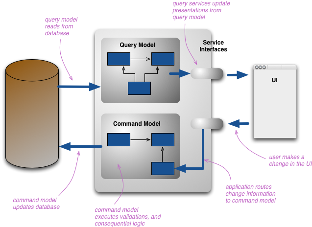

# **The CQRS Pattern**

The Command and Query Responsibility Segregation (CQRS) pattern states that we must separate the operations for reading the data from the operations for writing or updating the data. This means that functions for reading and writing data are not kept in the same interface or class. The main advantages of doing this include:
1. Separate teams can work on these operations
2. Each can be made to scale according to their own needs. Write operations are mostly used much less than read operations
3. Each can have their own security as per requirements
4. Read operations can have a different architecture to support caching, conversions to data transformation objects as required by clients
5. Write operations can include data validation. lookups etc.

However, do keep in mind that this pattern is better suited to larger applications where the requirements and load levels between read and write operations are different. For a simple and small application, the normal CRUD pattern, often auto-generated from ORM tools, is sufficient.

This is a simple implementation of the CQRS pattern in a C# .NET console application.

